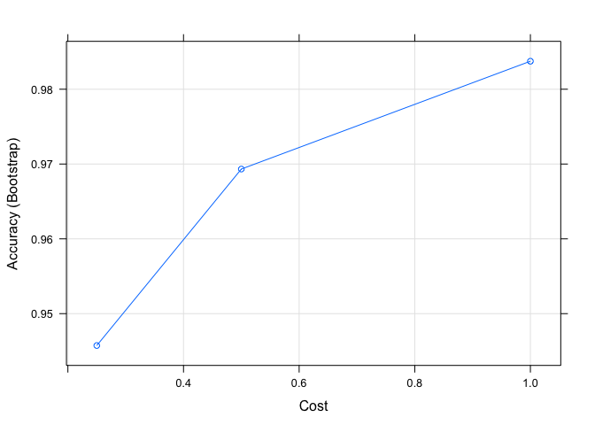

# Acitvity Recognition
Anthony Cato  
May 10, 2017  


## R Markdown

```r
suppressMessages(library(caret))
suppressMessages(library(kernlab))
suppressMessages(library(randomForest))
suppressMessages(library(scales))
```

## Summary
The goal of this project is to use data from accelerometers on the belt, forearm, arm, and dumbell to predict the manner in which 6 individuals performed a barbell exercise. The structure of the data and the provided problem statement lends itself well to a Classification ML model and so, in choosing which model to use, I tested prediction algorithms of this variety.  


```r
training.url <- "https://d396qusza40orc.cloudfront.net/predmachlearn/pml-training.csv"
testing.url <- "https://d396qusza40orc.cloudfront.net/predmachlearn/pml-testing.csv"
training <- read.csv(training.url)
testing <- read.csv(testing.url)
```

## Data Cleaning
Before building the model, I decided to remove many of the columns that I deemed unnecessary for improving predictive accuracy (e.g. a person's name and any compiled average, standard deviation or variance data) 

```r
unused.cols <- c("user_name", "V1", "timestamp", "window")

RemoveUnusedCols <- function(data) {
    data[ , -which(names(data) %in% unused.cols)]
    return(data)
}

# Remove id and names
training <- RemoveUnusedCols(training)
testing <- RemoveUnusedCols(testing)
```

Beyond the user_name, timestamp, and window data that was removed in the previous section, I instantiated a vector ```cols.to.remove``` to which I appended any other columns subject for removal.

```r
# Remove columns containing average, stddev, and variance data
cols.to.remove <- c()
# CT --> Central Tendency 
ct.cols <- grep("^avg_|stddev_|var_", names(training))
ct.cols <- names(training)[ct.cols]
cols.to.remove <- c(cols.to.remove, ct.cols)
```

### Missing data threshold
I created a somewhat arbitrary missing data threshold of 75%, where if more than 75% is missing from any column, I added that column's name to ```cols.to.remove```, which I will use to filter out of the cleaned training and test data. 

```r
missing.data.threshold <- .75
num.observations <- nrow(training)
for (i in seq(ncol(training))) {
    total.na <- sum(is.na(training[, i]))
    total.empty <- sum(training[, i] == "", na.rm = TRUE)
    total.missing <- total.na + total.empty
    if (total.missing / num.observations > missing.data.threshold & 
        (!names(training)[i] %in% cols.to.remove)) {
        cols.to.remove <- c(cols.to.remove, names(training)[i])
    }
}

indices.to.keep <- !names(training) %in% cols.to.remove
training.clean <- training[, indices.to.keep] 
testing.clean <- testing[, indices.to.keep]
```


```r
set.seed(187)
# Partition training set
inTrain <- createDataPartition(training.clean$classe,
                               p = .6,
                               list = FALSE)

train <- as.data.frame(training.clean)[inTrain,]
train.test <- as.data.frame(training.clean)[-inTrain,]
```


```r
# Build Random Forest model
mod.rf <- train(classe ~ .,
                data = train,
                method = "rf")


pred.rf <- predict(mod.rf, train.test)
```


```r
# Build SVM model
mod.svm <- train(classe ~ .,
                 data = train,
                 method = "svmRadial")

pred.svm <- predict(mod.svm, train.test)
```


```r
# Build Rpart model
mod.rpart <- train(classe ~ .,
                   data = train,
                   method = "rpart")


pred.rpart <- predict(mod.rpart, train.test)
```
Behind the scenes, the above models using 25 resamplings of the data for cross-validation purposes. This helps ensure that the predictive accuracy of the models is reflective of various slices of the data and that the model's results were not just due to luck. 

## Model Plots

```r
par(mfrow=c(1,3))

plot(mod.rf)
```

<!-- -->

```r
plot(mod.svm)
```

<!-- -->

```r
plot(mod.rpart)
```

<!-- -->

## Confusion Matrices

```r
rf.conf.matrix <- confusionMatrix(train.test$classe, pred.rf)
rf.conf.matrix$table
```

```
##           Reference
## Prediction    A    B    C    D    E
##          A 2232    0    0    0    0
##          B    1 1517    0    0    0
##          C    0    0 1368    0    0
##          D    0    0    0 1286    0
##          E    0    0    0    0 1442
```

```r
svm.conf.matrix <- confusionMatrix(train.test$classe, pred.svm)
svm.conf.matrix$table
```

```
##           Reference
## Prediction    A    B    C    D    E
##          A 2231    0    0    0    1
##          B    0 1518    0    0    0
##          C    0    5 1357    6    0
##          D    0    0   95 1191    0
##          E    0    0    0   20 1422
```

```r
rpart.conf.matrix <- confusionMatrix(train.test$classe, pred.rpart)
rpart.conf.matrix$table
```

```
##           Reference
## Prediction    A    B    C    D    E
##          A 2232    0    0    0    0
##          B    0 1518    0    0    0
##          C    0    0    0    0 1368
##          D    0    0    0    0 1286
##          E    0    0    0    0 1442
```

```r
rf.acc <- rf.conf.matrix$overall['Accuracy']
svm.acc <- svm.conf.matrix$overall['Accuracy'] 
rpart.acc <- rpart.conf.matrix$overall['Accuracy']
```

### Model Accuracy (in order)
1. Random Forest (rf) - ``100%``
2. SVM (svmRadial) - ``98.4%``
2. Rpart (rpart) - ``66.2%``

## Misclassification Error (Out of Sample Error)

```r
# Random Forest
misclass.error.rf <- 1 - rf.acc

# Support Vector Machine
misclass.error.svm <- 1 - svm.acc

# Rpart (CART)
misclass.error.rpart <- 1 - rpart.acc
```

### Misclassification Error (in order of best/low to worst/high)
1. Random Forest (rf) - ``0.0127%``
2. SVM (svmRadial) - ``1.62%``
2. Rpart (rpart) - ``33.8%``

## Conclusion
Overall, the best performing Classification model was the Random Forest with an overall accuracy of ``100%`` (more precisely, 99.98%). The Support Vector Machine placed second in predictive accuracy with ``98.4%``. In last, the Rpart model performed the poorest with an accuracy of ``66.2%``. The Random Forest took a great deal of time to run compared to the other models, but yielded the best results. In production, would proabably lean towards using the SVM to save some time without sacrificing too much predictive accuracy.  
